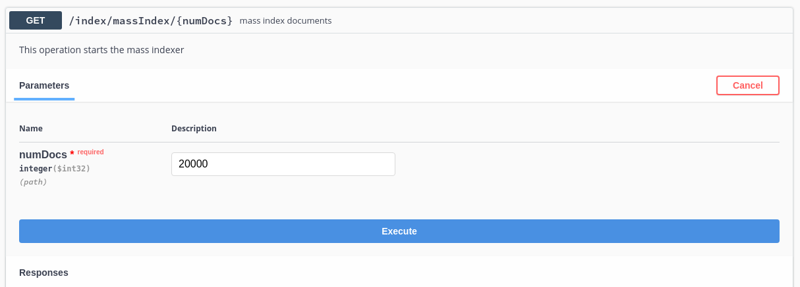
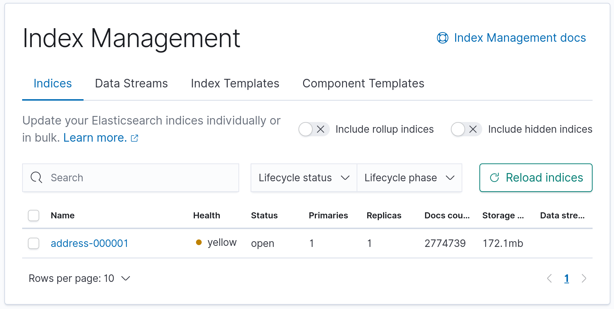
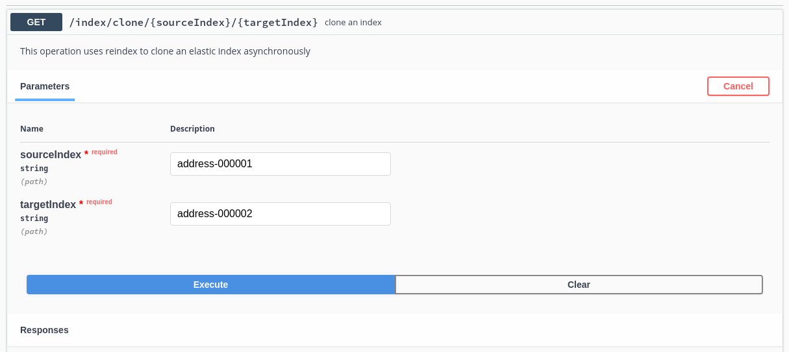
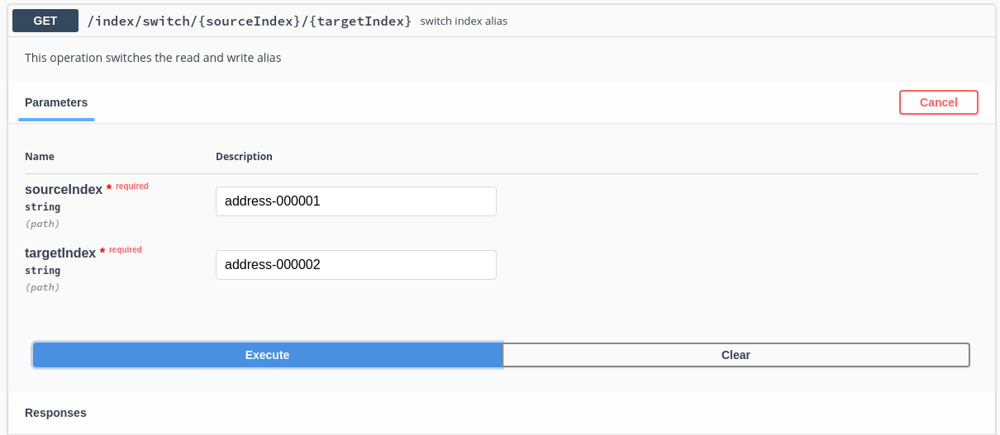

# address graphql project

Example search for addresses using Quarkus, Hibernate Search, GraphQL, ElasticSearch, Hibernate MassIndexer from PostgresSQL.

Run the Elastic and Kiabana pods locally
```bash
podman-compose up -d
```

Run the app
```aidl
mvn quarkus:dev -Dindex.recreate=true
```

The Address format is from AUS GNAF Dataset 

- Kibana available on `localhost:5601`
- GraphQL UI available on `locahost:8080`


Data Set based on Australia - G-NAF - Geoscape Geocoded National Address File (G-NAF)
- https://data.gov.au/dataset/ds-dga-19432f89-dc3a-4ef3-b943-5326ef1dbecc/details?q=

`import.sql` - has 2500 records of test data.

## Showcases

- graphql search to prevent over fetching of result data.
- elastic index templates for common settings
- elastic ingest pipeline for creating concatenated addresses field (address.address)
- low and high level rest client for searching and index manipulation (hibernate client is too slow at scale)
- hibernate massindexer for db -> index easyness
- uses simple json templates in /resources for creating/searching stuff, rather than complex java types (that you can cut and paste into the dev elastic console for example)


## REST Api

Manually index from database, bump up indexer for larger batches using the



If using large `import.sql`, turn on transactions for whole of file, top and tail with
```bash
begin;
end;
```

Also tested against different size data sets - 3+ million (all QLD addresses) and 15+ million (all AUS) gnaf records without issue.
```bash
pg_restore -h localhost -d quarkus_test -U quarkus_test -v ~/tmp/address.dmp
# dont reload database
quarkus.hibernate-orm.database.generation=none
# dont reload es-index
quarkus.hibernate-search-orm.schema-management.strategy=none
```



Clone the index

Here we clone `oneaddress-000002` to `oneaddress-000003`


and switching read/write alias to the new index.



Use the dev console in kibana or es endpoint to check:
```bash
GET _cat/indices?h=index&s=index
GET _cat/aliases
```
