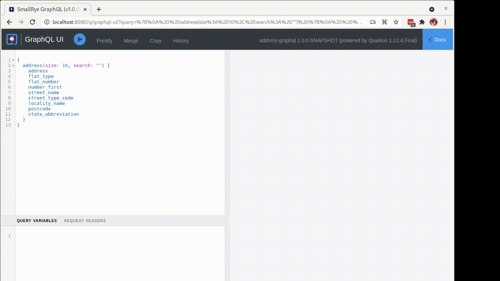
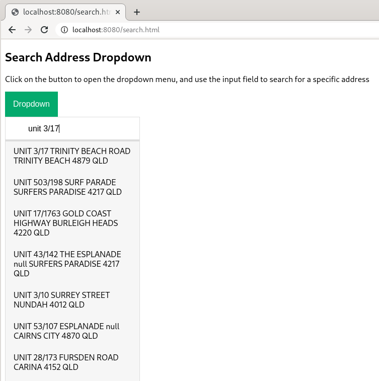

# address graphql project

Example search for addresses using Quarkus, Hibernate Search, GraphQL, ElasticSearch, Hibernate MassIndexer from PostgresSQL.

Run the Elastic and Kiabana pods locally
```bash
podman-compose up -d
```

Run the app
```aidl
mvn quarkus:dev
```

The Address format is from AUS GNAF Dataset 

- Kibana available on `localhost:5601`
- GraphQL UI available on `locahost:8080`



Data Set based on Australia - G-NAF - Geoscape Geocoded National Address File (G-NAF)
- https://data.gov.au/dataset/ds-dga-19432f89-dc3a-4ef3-b943-5326ef1dbecc/details?q=

`import.sql` - has 2500 records of test data.

## Different search data

Two search example page showcases completion searching as you enter text:
- `addresses` is a single address table with multiple address data fields as provided in the gnaf data dump.

We use graphql to prevent over fetching of result data.



## Test data

Bump up indexer for larger batches
```java
  searchSession.massIndexer()
    .batchSizeToLoadObjects(100000)
```

If using large `import.sql`, turn on transactions for whole of file, top and tail with
```bash
begin;
end;
```

Also tested against different size data sets - 3+ million (all QLD addresses) and 15+ million (all AUS) gnaf records without issue.
```bash
pg_restore -h localhost -d quarkus_test -U quarkus_test -v ~/tmp/address.dmp
# dont reload database
quarkus.hibernate-orm.database.generation=none
# dont reload es-index
quarkus.hibernate-search-orm.schema-management.strategy=none
```


## Clone the Index

API's added for demoing the cloning of an index created by hibernate, and switching read/write alias to the new index.

Here we clone `oneaddress-000002` to `oneaddress-000003`


Using the API's. `swtich`changes the read and write alias so search application can work on new index.


